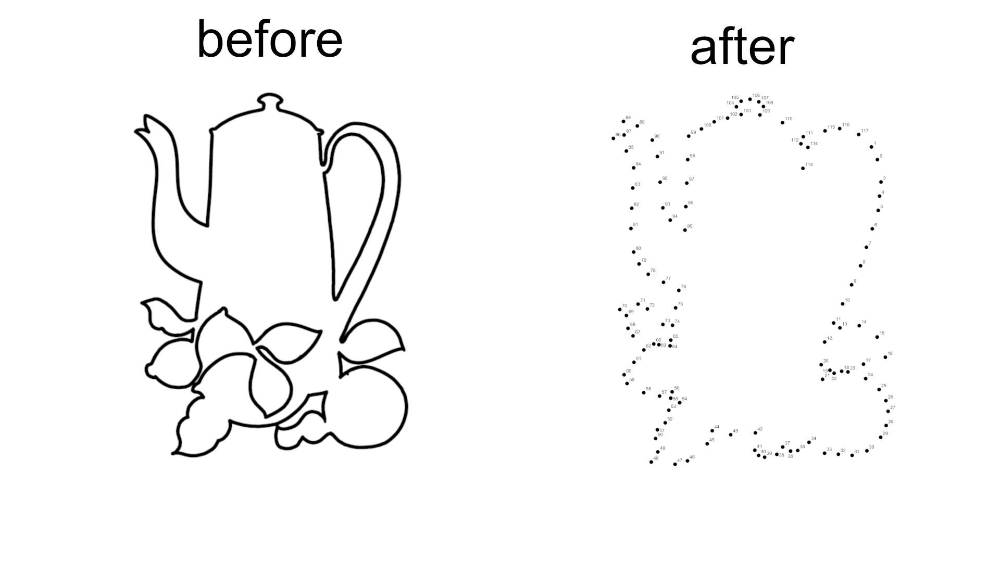

# Dot-to-Dot Image Processor

This project help creating from an image its equivalent for a dot to dot picture: 



More concretely, this tools processes an image to detect contours and generates an output image with dots placed along the contours. It also adds labels to each dot and allows for additional customizations such as dot color, radius, and distance between dots. For developers, optional debug mode is available to display intermediate results.

## Installation

Before running the script, make sure to install the required Python libraries. You can install them using the provided `requirements.txt` file.

```
pip install -r requirements.txt
```

## Usage

Ensure you have Python 3.6 or newer installed on your system. Clone this repository or download the script and `requirements.txt` file. Install the required libraries as mentioned above. To use the script, run it from the command line with the desired options:

```
python main.py [options]
```

## Options

- `-i`, `--input` <image>: Specify the input image path to process. Defaults to `input.png`.

- `-o`, `--output` <image path>: Specify the output image path. Defaults to `output.png`.
  
- `-f`, `--font` <font file>: Specify the font file name used for labeling. Defaults to `Arial.ttf`.
  
- `-fs`, `--fontSize` <size>: Specify the font size for labeling the dots. Defaults to `48`.
  
- `-fc`, `--fontColor` <color>: Specify the font color for labeling as 4 RGB values (e.g., `0 0 0 255` for black). Defaults to `black [0, 0, 0, 255]`.
  
- `-dc`, `--dotColor` <color>: Specify the dot color as 4 RGB values (e.g., `0 0 0 255` for black). Defaults to `black [0, 0, 0, 255]`.
  
- `-r`, `--radius` <radius>: Specify the radius of the dots in pixels. Defaults to `20`.

- `-d`, `--dpi` <dpi>: Specify the DPI (dots per inch) of the output image. Defaults to `400`.

- `-e`, `--epsilon` <epsilon>: Set the approximation accuracy for contour simplification as a percentage of the contour perimeter. This defined the first number of points used to approximate the contour. Defaults to `0.001`.

- `-dma`, `--distanceMax` <max distance>: Set the maximum distance between dots as a percentage of the image diagonal. Defaults to `0.05`.

- `-dmi`, `--distanceMin` <min distance>: Set the minimum distance between dots as a percentage of the image diagonal. If set, dots closer than this distance will be filtered out. Defaults to `0.01`.

- `-de`, `--debug`: Enable debug mode to display intermediate steps such as the contours and dot placements.

- `-do`, `--displayOutput`: Display the output image after processing. Defaults to `False`.

- `-v`, `--verbose`: Enable verbose mode to print progress information during the execution.


## Example

To process an image and generate an output with default settings:

```
python main.py -i my_image.png -o my_output.png
```

To process an image with a specific font and enable debug mode:

```
python main.py -i my_image.png -f Verdana.ttf -fs 36 -de -do
```

In this example, the script will process `my_image.png`, use `Verdana.ttf` font with size 36, enable debug mode to show intermediate steps, and display the final output.


## License

This project is open source and available under the MIT License.
