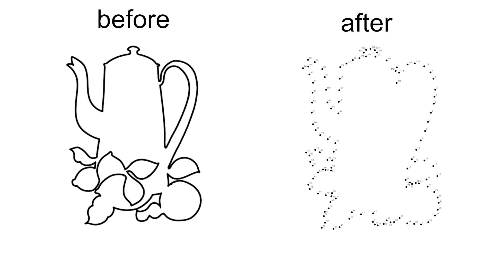
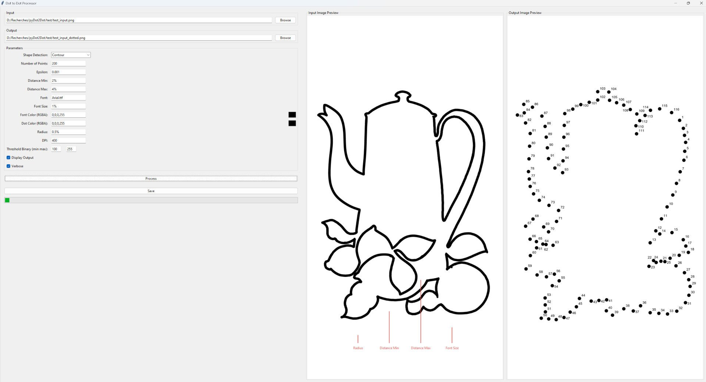
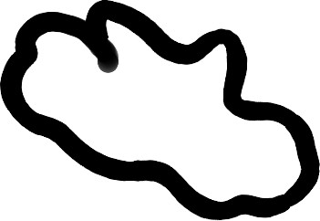
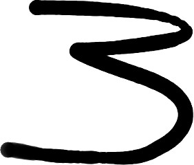

# Dot-to-Dot Image Processor

This project helps in creating a dot-to-dot version of an image:



This tool processes an image to detect contours or paths and generates an output image with dots placed along them. It also adds labels to each dot and allows for additional customization such as dot color, radius, and distance between dots. 



## Installation

Before running the script, make sure to install the required Python libraries. You can install them using the provided `requirements.txt` file.

```
pip install -r requirements.txt
```

## Usage

Ensure you have Python 3.6 or newer installed on your system. Clone this repository or download the scripts and `requirements.txt` file. Install the required libraries as mentioned above. To use the script, run it from the command line with the desired options:

```
python main.py [options]
```

By default it launches the gui windows like the example above, but you can apply the computation only with command line arguments and no graphics.

## Options

- `-g`, `--gui`: Open the gui or used the console mode. Defaults to `True`.

- `-i`, `--input` `<image>`: Specify the input image path or a folder of images to process. Defaults to `input.png`. If a folder is provided, all images inside will be processed.

- `-o`, `--output` `<image path>`: Specify the output image path or folder. If not provided, the input name with `_dotted` will be used.

- `-sd`, `--shapeDetection` `<method>`: Shape detection method to use. Choose between `"Contour"` or `"Path"`. Defaults to `"Contour"`.

- `-np`, `--numPoints` `<number>`: Desired number of points in the simplified path (applies to both methods). If not specified, all points after processing will be used.

- `-d`, `--distance` `<min> <max>`: Minimum and maximum distances between points. You can provide the values in pixels or as percentages of the image diagonal. For example, `-d 20 50` specifies a minimum distance of 20 pixels and a maximum of 50 pixels, while `-d 5% 10%` specifies distances as percentages of the image diagonal. Has no default value, therefore points could overlap each other by default.

- `-e`, `--epsilon` `<epsilon>`: Epsilon for path approximation. Defaults to `0.001`.

- `-f`, `--font` `<font file>`: Specify the font file name used for labeling. Searched automatically in `C:\Windows\Fonts`. Defaults to `Arial.ttf`.

- `-fs`, `--fontSize` `<size>`: Specify the font size for labeling the dots. You can provide the size in pixels or as a percentage of the image diagonal. For example, `-fs 12` specifies a font size of 12 pixels, while `-fs 1%` specifies a font size of 1% of the diagonal length. Default is `1%`.

- `-fc`, `--fontColor` `<r> <g> <b> <a>`: Specify the font color for labeling as 4 values in RGBA format (e.g., `0 0 0 255` for black). Defaults to `0 0 0 255`.

- `-dc`, `--dotColor` `<r> <g> <b> <a>`: Specify the dot color as 4 values in RGBA format (e.g., `0 0 0 255` for black). Defaults to `0 0 0 255`.

- `-r`, `--radius` `<radius>`: Specify the radius of the dots. You can provide the radius in pixels or as a percentage of the image diagonal. For example, `-r 10` specifies a radius of 10 pixels, while `-r 2%` specifies a radius of 2% of the diagonal length. Default is `0.5%`.

- `--dpi` `<dpi>`: Specify the DPI (dots per inch) of the output image. Defaults to `400`.

- `-tb`, `--thresholdBinary` `<threshold> <max_value>`: Specify the threshold value and maximum value for binary thresholding. Defaults to `100 255`.

- `-de`, `--debug`: Enable debug mode to display intermediate steps such as the contours and dot placements.

- `-do`, `--displayOutput`: Display the output image after processing. Defaults to `True`.

- `-v`, `--verbose`: Enable verbose mode to print progress information during execution. Defaults to `True`.

- `-h`, `--help`: Displays information about every argument.


## Examples

### Basic Usage

To process an image with default settings:

```
python main.py -i "my_image.png" 
```

### Two ways to change sizes

1. **Using pixel values for radius and font size**:
   ```
   python main.py --input image.png --radius 10 --fontSize 15
   ```
   In this example, the radius of the dots will be 10 pixels, and the font size for labels will be 15 pixels.

2. **Using percentages for radius and font size**:
   ```
   python main.py --input image.png --radius 5% --fontSize 2%
   ```
   In this example, the radius of the dots will be 5% of the diagonal of the image, and the font size will be 2% of the diagonal.

### Customizing the number of points and distances

- **Contour method with desired points**:
  ```
  python main.py -i "image.png" -sd Contour --numPoints 50
  ```
  This will use the Contour method to detect shapes and simplify them to approximately 50 points.

- **Path method with distance constraints**:
  ```
  python main.py -i "image.png" -sd Path -d 10 50
  ```
  In this case, the Path method will be used, and dots will be placed with a minimum distance of 10 pixels and a maximum of 50 pixels between them.

### Using both distance and number of points

You can combine the `distance` and `numPoints` parameters to control both the number of dots and their spacing:

```
python main.py -i "image.png" -sd Contour -np 100 -d 5% 10%
```

This will first simplify the path to around 100 points and then adjust the placement of dots so that the distance between them is between 5% and 10% of the diagonal length.

### Enabling Debug Mode

To visualize intermediate steps such as contours and dot placement, enable the debug mode:

```
python main.py -i "image.png" -de True
```

### Controlling the Dot Color and Labels

You can change the color of the dots and labels by specifying the RGBA values:

```
python main.py -i "image.png" -dc 255 0 0 255 -fc 0 0 255 255
```

This example will make the dots red and the labels blue.

## More about the placement of the dots

The placement of the dots is controlled by the `-sd` or `--shapeDetection` argument, which determines the method used to detect shapes in the image. There are two methods available:

- **Contour Method (`-sd Contour`)**: This method detects the contours in the image using OpenCV's contour detection algorithms. It approximates the contours of shapes in the image and places dots along these contours. This method is suitable for images with "closed" shapes. A closed shape has an endpoint that connects back to its beginning, such as this one:




- **Path Method (`-sd Path`)**: This method uses skeletonization to extract the central path or skeleton of the largest shape in the image. It is useful for images with shapes that are "open," where the shape starts and ends at different points, like this one:



## More about the number of dots

The number of dots placed along the paths is influenced by several parameters that control the simplification and spacing of the points:

- **Epsilon (`-e`, `--epsilon`)**: This parameter controls the approximation accuracy for contour simplification. A smaller epsilon value results in a higher number of points (more detailed contours), while a larger epsilon value reduces the number of points by simplifying the contours more aggressively. Lowering the epsilon value increases the number of dots, capturing finer details of the shape.

- **Distance (`-d`, `--distance` `<min> <max>`)**: These values set the minimum and maximum distances between points as percentages of the image diagonal. The script enforces these distance constraints after simplifying the path. Points closer than the minimum distance will be removed, and midpoints will be inserted between points that are farther apart than the maximum distance. The distance parameters have priority over the desired number of points (`numPoints`).

- **Desired Number of Points (`-np`, `--numPoints`)**: This parameter specifies the desired number of points in the simplified path. The script will first attempt to simplify the path to approximately this number of points using the Visvalingam–Whyatt algorithm.

### Priority of Parameters

The script processes the number of dots in the following order:

1. **Initial Simplification**: The path is simplified to reach the desired number of points specified by `numPoints` using the epsilon value and simplification algorithms.

2. **Enforcing Distance Constraints**: After simplification, the script adjusts the points to satisfy the minimum and maximum distance requirements:

   - **Insertion of Midpoints**: If the distance between two consecutive points exceeds the maximum distance (`distance max`), additional points (midpoints) are inserted to reduce the spacing.

   - **Removal of Points**: If points are closer than the minimum distance (`distance min`), they are removed to increase the spacing.

Due to this process, the distance constraints have priority over the desired number of points. The script will adjust the number of dots by adding or removing points to ensure that all points meet the specified distance requirements, even if this means deviating from the initial `numPoints` value.
