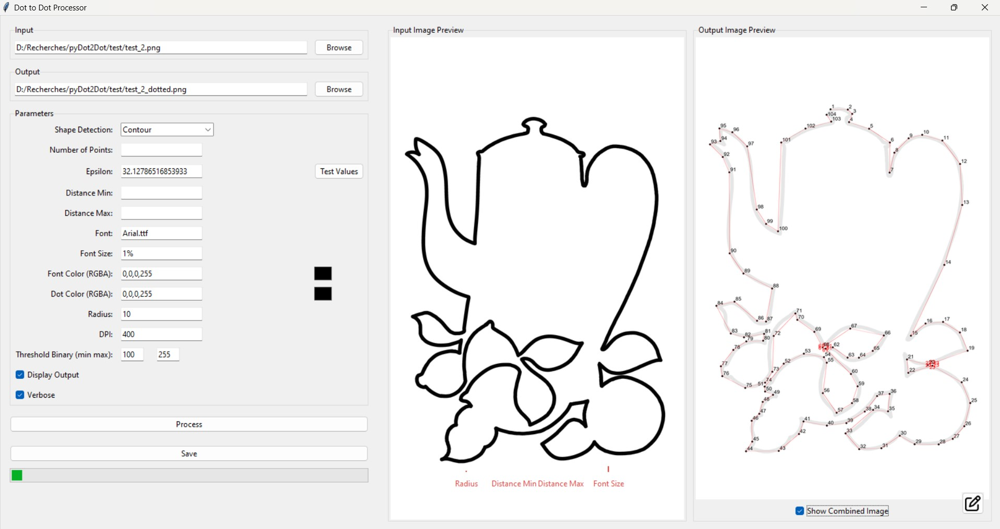

# Dot to Dot

Transform your favorite images into engaging dot-to-dot puzzles with ease! Whether you're an artist looking to create interactive artwork, an educator designing educational materials, or simply someone who enjoys creative projects, the **Dot to Dot** offers a user-friendly solution to convert images into customizable dot-to-dot formats.


## Features

### **1. User-Friendly for Artists**
- **Intuitive Interface:** Designed with artists in mind, the tool offers an easy-to-navigate GUI that allows for seamless customization and previewing of dot placements.
- **Epsilon Parameter Focus:** Artists can effortlessly adjust the epsilon parameter using the Test Values window to achieve the desired level of detail in their dot-to-dot creations.




### **2. Advanced Shape Detection**
- **Contour Method:** Utilizes OpenCV's robust contour detection algorithms to identify and simplify closed shapes within an image. Ideal for images with well-defined boundaries.
  
  

- **Path Method:** Employs skeletonization techniques to extract the central path of open or complex shapes. Perfect for images where shapes do not have closed boundaries.
  
  

### **3. Customizable Dot Placement**
- **Adjustable Dot Radius:** Define the size of the dots either in pixels or as a percentage of the image's diagonal, allowing for flexibility based on image resolution and desired detail level.
- **Dot Color Selection:** Choose from any RGBA color to match your aesthetic preferences or project requirements.
- **Dynamic Distance Control:** Set minimum and maximum distances between dots, either in pixels or percentages, ensuring optimal spacing for clarity and visual appeal.

### **4. Intelligent Labeling**
- **Automatic Labeling:** Each dot is automatically labeled for easy navigation and connection, enhancing the usability of the generated dot-to-dot images.
- **Custom Font Options:** Select your preferred font type and size, either in pixels or percentages, to ensure labels are both readable and stylistically consistent with your design.

### **5. Interactive Testing Window**
- **Epsilon Testing:** Use the Test Values window to experiment with different epsilon settings and instantly visualize their impact on dot placement. This allows artists to fine-tune the level of detail before finalizing the dot positions.

### **6. Flexible Output Options**
- **Single Image Processing:** Convert individual images into dot-to-dot puzzles with customized settings.
- **Batch Processing:** Handle multiple images simultaneously by specifying input folders, streamlining the creation of multiple puzzles in one go.
- **High-Resolution Support:** Generate output images at various DPI settings, ensuring high-quality prints or digital displays.

### **7. Edit Window for Enhanced Customization**
- **Interactive Editing:** Open the Edit Window by clicking the pencil icon on the output image. This window provides additional controls to adjust dot positions, colors, and labels interactively.
- **Real-Time Updates:** Make adjustments on-the-fly and see immediate changes reflected in the preview, allowing for precise customization tailored to your artistic vision.

## How It Works

### **1. Parametrization**
Customize your dot-to-dot creation by adjusting key parameters:
- **Epsilon:** Controls the approximation accuracy for contour simplification. Start by testing different epsilon values using the Test Values window (click on the bottom next to the input field) to determine the ideal level of detail.
- **Distance Min and Max:** Define the minimum and maximum distances between dots to control spacing.
- **Number of Points:** Specify the desired number of points to balance detail and simplicity.


### **2. Processing**
Once parameters are set:
1. **Shape Detection:** Choose between the Contour or Path method based on your image's characteristics.
2. **Simplification:** The tool simplifies the detected shapes according to the epsilon value and the number of points specified.
3. **Dot Placement:** Dots are strategically placed along the simplified contours or paths, adhering to the defined distance constraints.
4. **Labeling:** Each dot is automatically labeled for easy connectivity.

### **3. Saving Results**
After processing:
- **Preview:** Review your dot-to-dot creation within the GUI.
- **Edit (Optional):** Click the pencil icon to open the Edit Window for further customization.
- **Export:** Save the final dot-to-dot image in your preferred format, ready for printing or digital use.

## Edit Window

Enhance and refine your dot-to-dot creations using the **Edit Window**, accessible by clicking the pencil icon on the output image. This powerful feature offers:

- **Dot Manipulation:** Move dots individually to perfect their placement or adjust the overall shape.
- **Label Editing:** Modify labels for clarity or aesthetic purposes, including changing fonts, sizes, and colors.
- **Color Customization:** Change the color of dots and lines to match your creative vision.
- **Real-Time Preview:** See changes instantaneously on the canvas, enabling precise adjustments without the need for reprocessing.
- **Link Dots Option:** Toggle lines between dots to visualize the path that the users to follow.


## Usage

Ensure you have [Python](https://www.python.org/downloads/) 3.6 or newer installed on your system. Then you can simply launch the application with `dot_2_dot.exe`.

## Details about Parameters

### Two Ways to Change Sizes

1. **Using Pixel Values for Radius and Font Size:**

   ```
   Radius 10
   ```

   In this example, the radius of the dots will be 10 pixels, and the font size for labels will be 15 pixels.

2. **Using Percentages for Radius and Font Size:**

   ```
   Font Size 2%
   ```

   In this example, the radius of the dots will be 5% of the diagonal of the image, and the font size will be 2% of the diagonal.

### Using Both Distance and Number of Points

You can combine the `distance` and `numPoints` parameters to control both the number of dots and their spacing.

```
Number of Points 100 
Distance Min 5%
Distance Max 10%
```

This will first simplify the path to around 100 points and then adjust the placement of dots so that the distance between them is between 5% and 10% of the diagonal length.

### More about the Placement of the Dots

The placement of the dots is controlled by the `Shape Detection` argument, which determines the method used to detect shapes in the image. There are two methods available:

- **Contour Method (`Shape Detection Contour`)**: This method detects the contours in the image using OpenCV's contour detection algorithms. It approximates the contours of shapes in the image and places dots along these contours. This method is suitable for images with "closed" shapes. A closed shape has an endpoint that connects back to its beginning, such as this one:

  

- **Path Method (`Shape Detection Path`)**: This method uses skeletonization to extract the central path or skeleton of the largest shape in the image. It is useful for images with shapes that are "open," where the shape starts and ends at different points, like this one:

  

### More about the Number of Dots

The number of dots placed along the paths is influenced by several parameters that control the simplification and spacing of the points:

- **Epsilon**: This parameter controls the approximation accuracy for contour simplification. A smaller epsilon value results in a higher number of points (more detailed contours), while a larger epsilon value reduces the number of points by simplifying the contours more aggressively. Lowering the epsilon value increases the number of dots, capturing finer details of the shape.

- **Distance Min and Max**: These values set the minimum and maximum distances between points as percentages of the image diagonal. The script enforces these distance constraints after simplifying the path. Points closer than the minimum distance will be removed, and midpoints will be inserted between points that are farther apart than the maximum distance. The distance parameters have priority over the desired number of points (`Number of Points`).

- **Desired Number of Points**: This parameter specifies the desired number of points in the simplified path. The script will first attempt to simplify the path to approximately this number of points using the Visvalingam–Whyatt algorithm.


## Command Line Usage (Advanced)

For advanced usage, you can use the application through the command line.

### Installation

Before running the script, make sure to install the required Python libraries. You can install them using the provided `requirements.txt` file.

```
pip install -r requirements.txt
```

### Usage

Ensure you have Python 3.6 or newer installed on your system. Clone this repository or download the scripts and `requirements.txt` file. Install the required libraries as mentioned above. To use the script, run it from the command line with the desired options:

```
python main.py [options]
```

By default, it launches the GUI windows like the example above, but you can apply the computation only with command line arguments and no graphics.

### Options

- `-g`, `--gui`: Open the GUI or use the console mode. Defaults to `True`.

- `-i`, `--input` `<image>`: Specify the input image path or a folder of images to process. Defaults to `input.png`. If a folder is provided, all images inside will be processed.

- `-o`, `--output` `<image path>`: Specify the output image path or folder. If not provided, the input name with `_dotted` will be used.

- `-sd`, `--shapeDetection` `<method>`: Shape detection method to use. Choose between `"Contour"` or `"Path"`. Defaults to `"Contour"`.

- `-np`, `--numPoints` `<number>`: Desired number of points in the simplified path (applies to both methods). If not specified, all points after processing will be used.

- `-d`, `--distance` `<min> <max>`: Minimum and maximum distances between points. You can provide the values in pixels or as percentages of the image diagonal. For example, `-d 20 50` specifies a minimum distance of 20 pixels and a maximum of 50 pixels, while `-d 5% 10%` specifies distances as percentages of the image diagonal. Has no default value, therefore points could overlap each other by default.

- `-e`, `--epsilon` `<epsilon>`: Epsilon for path approximation. Defaults to `0.001`.

- `-f`, `--font` `<font file>`: Specify the font file name used for labeling. Searched automatically in `C:\Windows\Fonts`. Defaults to `Arial.ttf`.

- `-fs`, `--fontSize` `<size>`: Specify the font size for labeling the dots. You can provide the size in pixels or as a percentage of the image diagonal. For example, `-fs 12` specifies a font size of 12 pixels, while `-fs 1%` specifies a font size of 1% of the diagonal length. Default is `1%`.

- `-fc`, `--fontColor` `<r> <g> <b> <a>`: Specify the font color for labeling as 4 values in RGBA format (e.g., `0 0 0 255` for black). Defaults to `0 0 0 255`.

- `-dc`, `--dotColor` `<r> <g> <b> <a>`: Specify the dot color as 4 values in RGBA format (e.g., `0 0 0 255` for black). Defaults to `0 0 0 255`.

- `-r`, `--radius` `<radius>`: Specify the radius of the dots. You can provide the radius in pixels or as a percentage of the image diagonal. For example, `-r 10` specifies a radius of 10 pixels, while `-r 2%` specifies a radius of 2% of the diagonal length. Default is `0.5%`.

- `--dpi` `<dpi>`: Specify the DPI (dots per inch) of the output image. Defaults to `400`.

- `-tb`, `--thresholdBinary` `<threshold> <max_value>`: Specify the threshold value and maximum value for binary thresholding. Defaults to `100 255`.

- `-de`, `--debug`: Enable debug mode to display intermediate steps such as the contours and dot placements.

- `-do`, `--displayOutput`: Display the output image after processing. Defaults to `True`.

- `-v`, `--verbose`: Enable verbose mode to print progress information during execution. Defaults to `True`.

- `-h`, `--help`: Displays information about every argument.

### Examples

#### Basic Usage

To process an image with default settings:

```
python main.py -i "my_image.png" -g False
```

## Roadmap

- [ ] Adding a complete menu bar with settings and save
- [ ] Refactor the control window in main gui to be more intuitive
- [ ] Add automatic detection for shape and path
- [ ] Add shortcut to add dots directly by double clicking in edit window
- [ ] Add a logger 
- [ ] Make the whole project an executable with python and not with c++ 
- [ ] Improve the way error are retrieve in gui