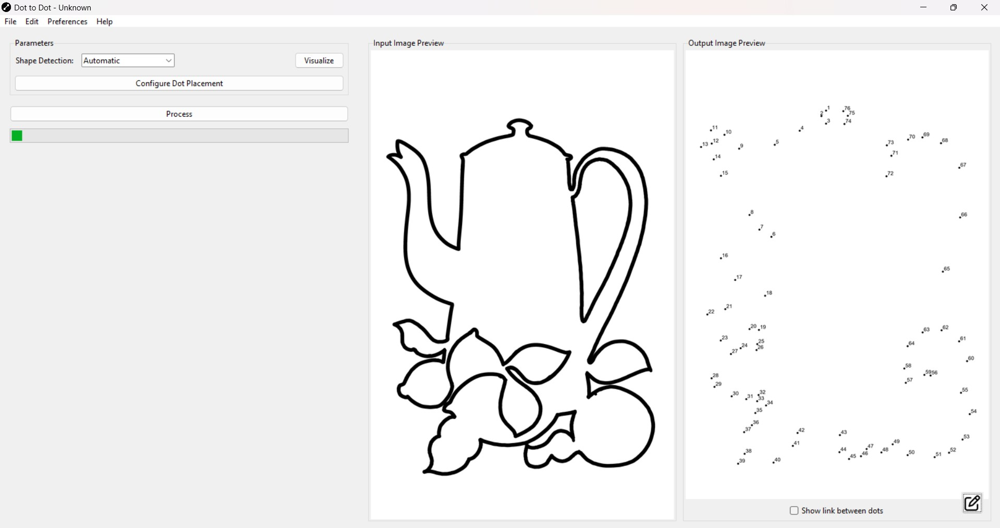
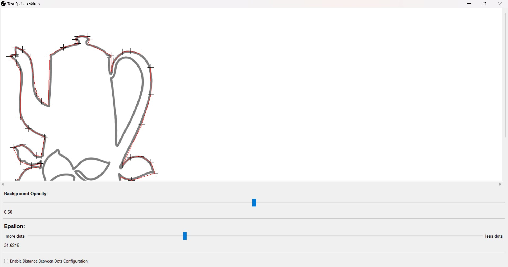
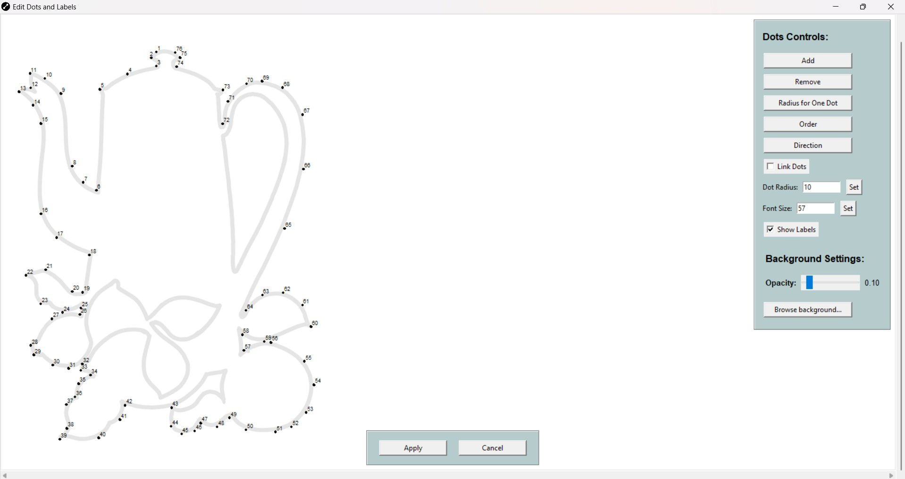

# Tutorial Example: Step-by-Step Guide to Creating a Dot-to-Dot Puzzle

This section provides a practical example to guide you through creating a dot-to-dot puzzle using **Dot to Dot**.

---

### Step 1: Open the Tool

Launch the **Dot to Dot** application. The main GUI will appear, showing placeholders for the **Input Preview** and **Output Preview**.

---

### Step 2: Define the Input Image

1. **Set Your Input Image**:
   - Double-click on the **Input Preview** area, or press **Ctrl+O** to open the file browser.
   - Select a `.png` or `.jpg` image to use as the base for your dot-to-dot creation.

2. **Verify the Input**:
   - Once the input image is loaded, it will appear in the **Input Preview** area.
   - You can pan through the image by holding the left mouse button and dragging or zoom in/out using the mouse wheel.

---

### Step 3: Visualize the Detected Shapes

1. **Open the Shape Visualization Window**:
   - Click the **Shape Visualization** button in the **Control Panel**.
   - This opens a new window showing the shapes detected in your input image.

2. **Verify the Detection**:
   - Ensure the shapes have been correctly identified.
   - Adjust the **Opacity Slider** to toggle the background's visibility.
   - Change the **Shape Detection Mode** if necessary:
     - **Automatic**: Automatically selects the best detection mode.
     - **Contour**: For closed shapes.
     - **Path**: For open shapes.
   - Close the window once you're satisfied with the detected shapes.

---

### Step 4: Define Dot Disposition

1. **Open the Dots Disposition Window**:
   - Click the **Dots Disposition** button in the **Control Panel**.

2. **Adjust Dot Placement**:
   - Use the **Opacity Slider** to modify the background's visibility.
   - Use the **Epsilon Slider** to adjust the number of dots:
     - Lower values result in more dots for higher detail.
     - Higher values reduce the number of dots for a simpler design.
   - Enable the **Distance Between Dots Configuration** toggle if needed:
     - Set **Maximum Distance** to control the farthest distance between dots.
     - Set **Minimum Distance** to enforce closer spacing between dots.
   - Close the window when you are satisfied with the preliminary dot placement.

---

### Step 5: Process the Image

1. **Process the Input**:
   - Double-click on the **Output Preview** area to process the input image with the parameters defined in the **Control Panel**.
   - Alternatively, press **Alt+P** to start processing.

2. **Review the Output**:
   - The processed dot-to-dot image will appear in the **Output Preview** area.

---

### Step 6: Edit the Output (If Necessary)

1. **Open the Edit Window**:
   - Double-click on the **Output Preview** area, or press **Alt+E**, to open the **Edit Window**.

2. **Resolve Overlaps**:
   - In the **Edit Window**, overlapping dots and labels are highlighted in red.
   - Use the following tools to refine the output:
     - **Move Dots**: Drag dots and labels to reposition them.
     - **Add Dots**: Double-click between two dots to insert a new dot.
     - **Delete Dots**: Click a dot and press `Delete` to remove it.
     - **Control Panel Options**:
       - Adjust **Dot Radius** or **Font Size**.
       - Toggle **Link Dots** to display connecting lines.
       - Use the **Opacity Slider** to improve visibility while editing.
   - Once all changes are made, click **Apply** to update the processed image.

---

### Step 7: Save Your Work for Future Edits

1. **Save as `.d2d`**:
   - Press **Ctrl+S** or use the **File > Save** menu to save your project in the `.d2d` format.
   - The `.d2d` format allows you to reopen and edit the project in the future.

---

### Step 8: Export the Final Image

1. **Export as PNG**:
   - Press **Ctrl+E** or use the **File > Export As** menu to save the processed image as a `.png` or `.jpg`.
   - Select the desired file format and location.

---

This step-by-step guide covers the entire workflow from loading an image to exporting the final dot-to-dot creation. With practice, you’ll be able to create custom puzzles quickly and efficiently. Happy creating! 🎨✨